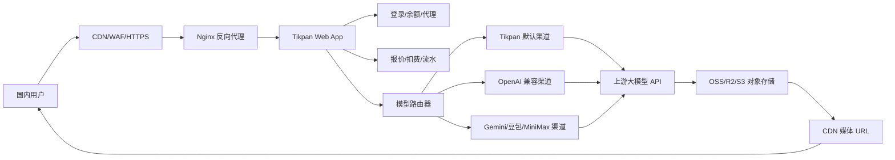

# Tikpan Web 商业架构与运维手册

## 1. 你的业务逻辑是否正确

是正确的。更准确地说，你做的不是普通网站，而是：

```text
用户参数配置界面 + 多供应商模型网关 + 余额计费系统 + 媒体结果分发系统
```

ComfyUI 自定义节点本质上是把参数打包成请求，再交给上游模型接口。网站可以做同样的事情，但要比节点多承担五个商业责任：用户鉴权、余额扣费、渠道选择、失败退款、运营审计。

## 2. 推荐总架构



## 3. 商业系统必须具备的模块

| 模块 | 现在状态 | 商业化要求 |
| --- | --- | --- |
| 模型配置 | 已有 | 后台可新增分类、模型、字段、下拉选项、默认值 |
| 渠道配置 | 已有 | 每个渠道要有 base_url、api_key、优先级、超时、启用状态 |
| 路由配置 | 已有 | 每个模型可绑定多个渠道，支持主备和后续权重 |
| 定价配置 | 已有 | 支持按分辨率、次数、时长、token、图片张数计费 |
| 扣费 | 已加强 | 先报价、再扣费、失败自动退款 |
| 余额账本 | 已新增 | 每次充值、消费、退款、代理费都要写不可变流水 |
| 幂等 | 已新增基础 | 前端/节点请求要传 `Idempotency-Key`，避免重复扣费 |
| 媒体存储 | 已支持 OSS | 图片/音频/视频结果走 OSS/CDN，应用服务器只返回 URL |
| 运维检查 | 已新增 | 上线前运行部署检查脚本 |

## 4. 请求生命周期

1. 用户选择模型并填写参数。
2. 前端请求 `/api/request-preview` 获取预计扣费和路由预览。
3. 用户确认后提交 `/api/generate`，请求头带 `Idempotency-Key`。
4. 后端校验模型、参数、文件数量和余额。
5. 写入 `balance_ledger` 消费流水，创建 `generation_logs` 任务。
6. 根据 `model_provider_routes` 选择渠道，把参数转换成上游 API 请求。
7. 上游成功后保存结果到 OSS/CDN，写成功日志。
8. 上游失败、超时、响应为空时写失败日志并退款。

## 5. 计费原则

不要只看用户余额字段，余额字段只是当前快照。真正的财务解释权在 `balance_ledger`：

- `recharge`: 充值入账。
- `generation_debit`: 生成任务扣费。
- `generation_refund`: 生成失败退款。
- `agent_fee`: 代理申请或代理服务扣费。
- `adjustment`: 管理员手动调整。

后续后台应该增加“余额流水”页面，让你可以按用户、订单、任务、时间筛选。

## 6. 渠道路由策略

启动期建议使用“优先级主备”：

1. 同一个模型配置多个渠道。
2. `priority` 数字越小越优先。
3. 主渠道失败后记录错误，人工或自动切换到备用渠道。

中期再升级为“健康度 + 权重”：

- 连续失败超过阈值，暂停渠道 5-15 分钟。
- 根据成功率、平均耗时、成本选择渠道。
- 高价渠道只做兜底，避免利润被吃掉。

## 7. 中国用户部署建议

单机起步：

- 主服务器：新加坡，4H4G + 30M CN2/优化线路可以起步。
- 对象存储：同区域 OSS/R2/S3。
- CDN：媒体文件走 CDN，避免 30M 带宽被大图和视频压满。
- Nginx：只反代 API 和页面，不直接承担大文件下载。

进阶架构：

- 香港或国内备案服务器做接入层。
- 新加坡做核心 API 层和上游请求层。
- 数据库每日备份到私有对象存储。

## 8. 部署步骤

参考依据：Flask 官方生产部署建议使用专门的 WSGI server，不使用内置开发服务器；Nginx 官方反代文档说明了 `proxy_pass` 把请求转给后端应用；Docker Compose 官方支持通过环境变量文件管理容器配置。本文档已经按这条路线整理成 Docker + Gunicorn + Nginx。

1. 复制环境变量：

```bash
cd web_app
cp .env.example .env
```

2. 修改 `.env`：

```bash
APP_ENV=production
PUBLIC_BASE_URL=https://你的域名
TRUST_PROXY=true
TIKPAN_API_KEY=sk-你的key
TIKPAN_SECRET=随机长字符串
FLASK_SECRET=随机长字符串
ADMIN_PASSWORD=强密码
```

3. 构建并启动：

```bash
docker compose up -d --build
```

4. 运行部署检查：

```bash
docker compose exec tikpan-web python scripts/deploy_check.py
```

5. 配置 Nginx，参考 `deploy/nginx-tikpan.conf`。

6. 打开后台 `/admin`，配置模型、字段、渠道、价格。

7. 生成一次测试任务，确认扣费、退款、OSS/CDN URL 都正常。

## 9. 迁移到新电脑或新服务器

迁移代码：

```bash
git pull
```

迁移业务配置：

```bash
python scripts/portable_db.py export --db data/tikpan.db --out data/config.export.json
python scripts/portable_db.py import --db data/tikpan.db --in data/config.export.json
```

迁移运行状态：

- `.env` 手动复制或用服务器密钥管理器配置。
- `data/tikpan.db` 只在你需要迁移用户、余额、订单、流水时复制。
- `outputs/` 不建议长期迁移，生产环境应以 OSS/CDN 为准。

## 10. 后期维护节奏

每天：

- 看生成失败率、退款次数、渠道异常。
- 看 OSS/CDN 流量，防止大文件成本失控。

每周：

- 导出后台配置。
- 抽查余额流水和订单是否一致。
- 测试主渠道和备用渠道。

每月：

- 轮换上游 key。
- 复核模型成本和售价。
- 清理过期媒体文件。
- 用备份在新机器做一次恢复演练。

## 11. 下一步开发优先级

1. 后台增加余额流水页面。
2. 后台增加渠道健康检查和测试按钮。
3. 生成任务改成异步队列，避免长视频请求卡住 Web 进程。
4. SQLite 迁移 PostgreSQL/MySQL。
5. 为公开 API 输出 OpenAPI 文档，方便代理商接入。
